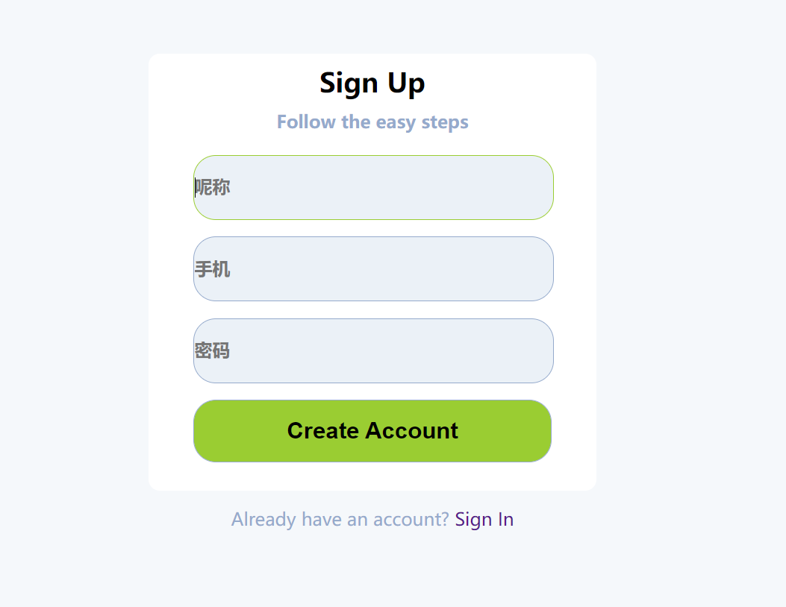
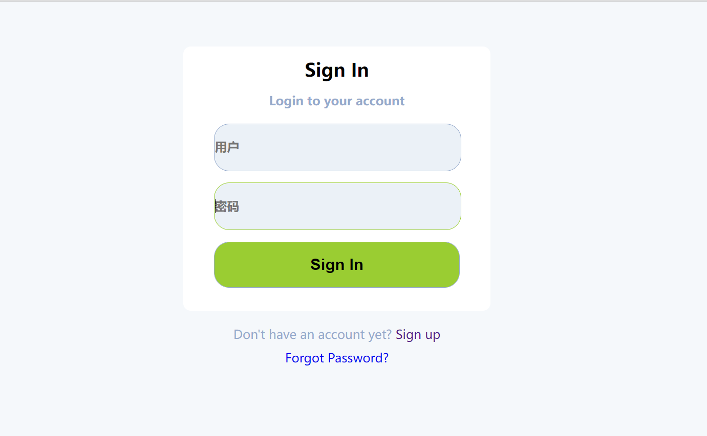
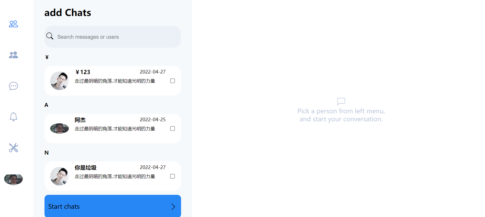
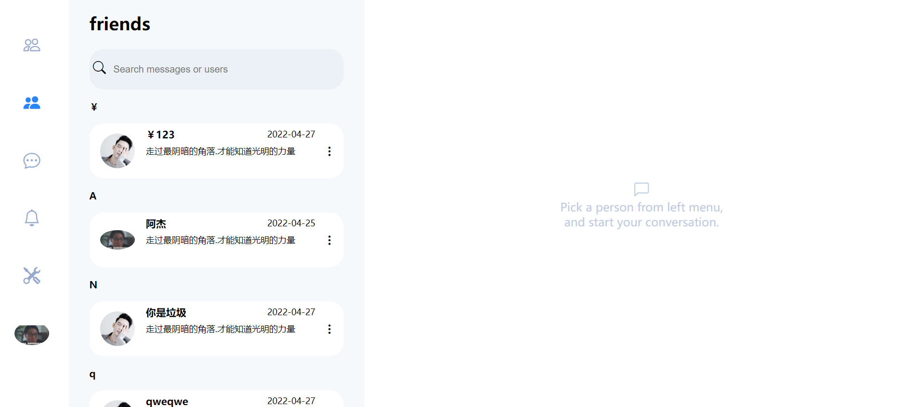
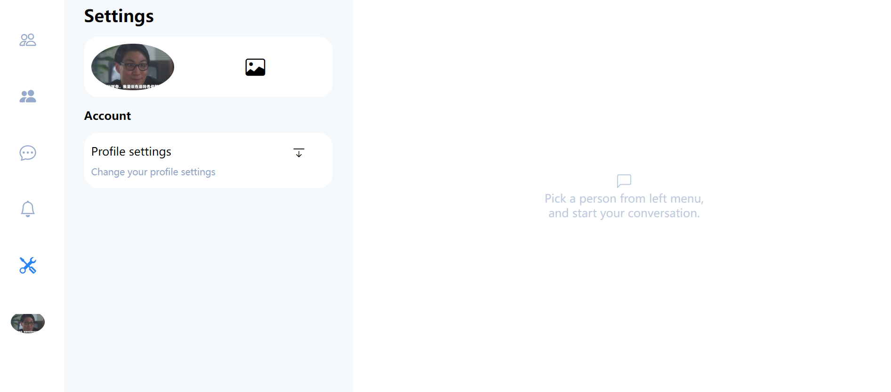
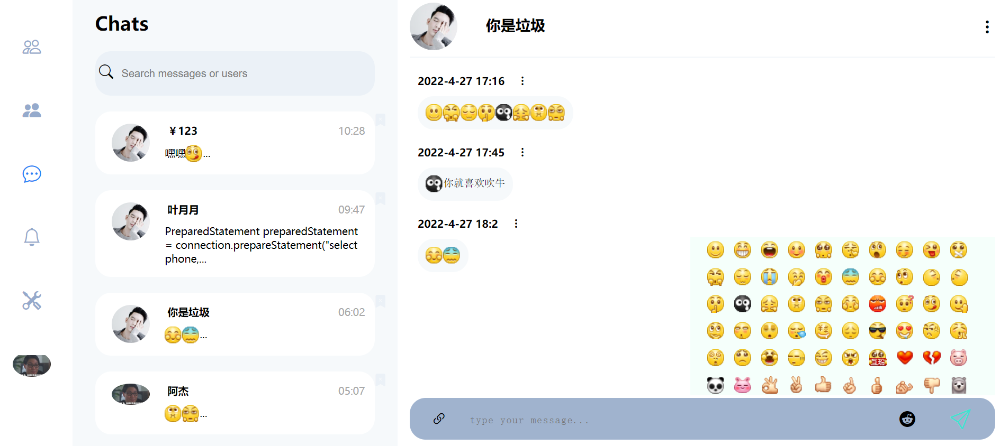

# dwbbs

#### 介绍
H5开源web聊天,目前已经完成了用户的注册、登录、添加好友、删除好友、

查询好友、添加聊天、显示聊天、上传用户图片、修改用户备注功能、

下一步准备设计通知机制.就目前的话比如说一个用户给你发了信息.现在默认是不会

自动接收到的.没有通知机制.需要刷新页面.或者点击聊天、才能查到最新的信息通知.

和后端数据交互使用的是websocket .前后端信息交互主要使用json格式.上传文件使

用的是自定的规则...

自定义的前后端JSON数据交互协议例:

```js
const queryCurrentFriends ={
    uuid:"",
    url:"queryUsersFriends",
    src:"queryUsersFriends",
    tar:"queryUsersFriends",
    charts:{
        nikeName:"",
        currentPage:1,
        totalPage:1,
        currentActiveId:"m1-friends",
        tokenSession:websktoken
    }
}
```

#### 界面图

注意目前只做了pc端css布局、只支持宽900px像素以上的设备浏览访问.

1. 注册界面
2. 登录 
3. 用户查询

4.好友列表

5.用户设置 支持选择图片上传 和拖拉 上传图片



6.聊天区域



#### 软件架构

软件架构说明
HTML5  javaScript  css  

#### 安装教程

1.  下载此项目源代码.
2.  放在任意一个前端服务器
3.  启动前端服务器访问

#### 使用说明

1.   需要配合后端使用.
2.  https://gitee.com/mydreams2018/cpdog

#### 参与贡献

1.  Fork 本仓库
2.  新建 Feat_xxx 分支
3.  提交代码
4.  新建 Pull Request


#### 特技

1.  使用 Readme\_XXX.md 来支持不同的语言，例如 Readme\_en.md, Readme\_zh.md
2.  Gitee 官方博客 [blog.gitee.com](https://blog.gitee.com)
3.  你可以 [https://gitee.com/explore](https://gitee.com/explore) 这个地址来了解 Gitee 上的优秀开源项目
4.  [GVP](https://gitee.com/gvp) 全称是 Gitee 最有价值开源项目，是综合评定出的优秀开源项目
5.  Gitee 官方提供的使用手册 [https://gitee.com/help](https://gitee.com/help)
6.  Gitee 封面人物是一档用来展示 Gitee 会员风采的栏目 [https://gitee.com/gitee-stars/](https://gitee.com/gitee-stars/)
